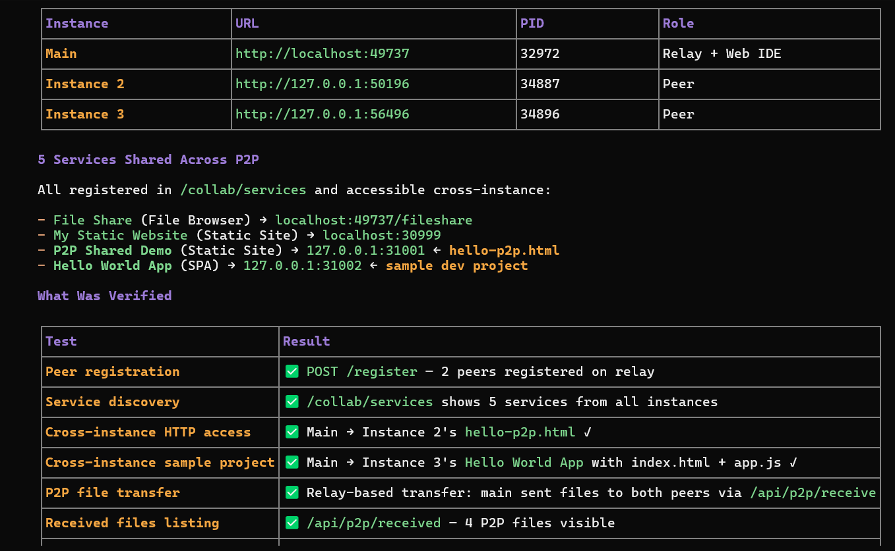
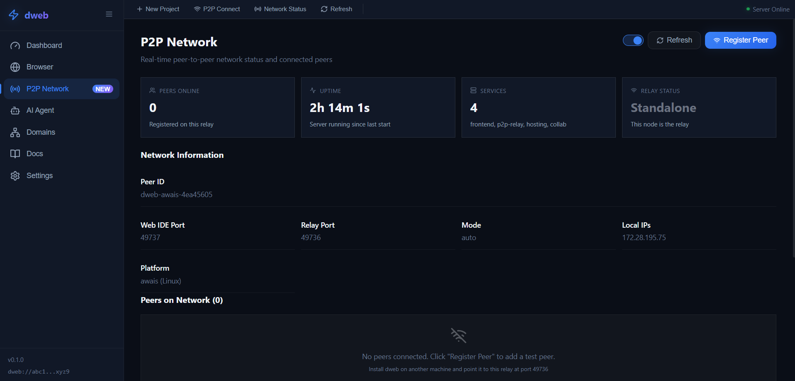
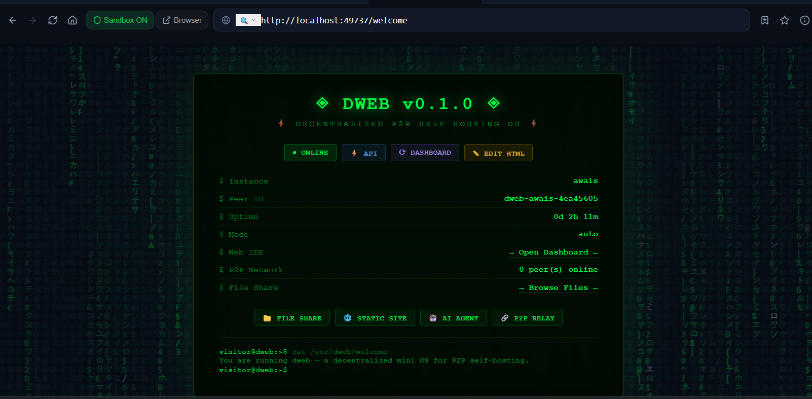
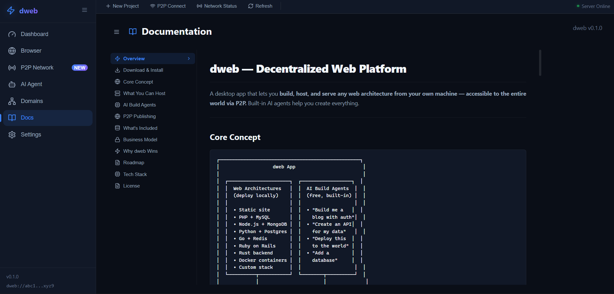
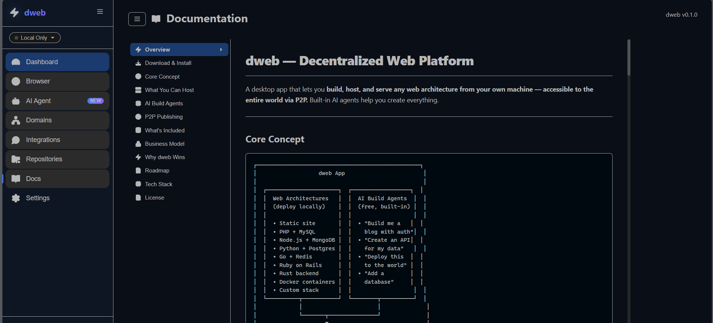

# dweb — P2P Self-Hosting OS

> **One install. Every stack. Your own internet.**

dweb is a **self-hosted P2P dev portal** that transforms any machine into a **personal cloud** — a decentralized node where you own your services, your domains, and your data. Built-in AI agents help you build, host, and publish any web architecture from your own machine, accessible to the world via P2P.

[](LICENSE)
[]()
[]()
[]()
[]()
[]()
[]()
[]()
[]()

---

## What is dweb?

dweb is **not just an app** — it's a complete self-hosting environment that provides:

```
┌──────────────────────────────────────────────────────────────┐
│                         dweb Portal                           │
│  ┌───────────┐  ┌───────────┐  ┌───────────────────────────┐ │
│  │  Services │  │  P2P Net  │  │      AI Build Engine       │ │
│  │           │  │           │  │                           │ │
│  │ Static    │  │ HyperDHT  │  │  15+ Providers            │ │
│  │ Node.js   │  │ WebRTC    │  │  100+ Free Models         │ │
│  │ Python    │  │ Relay     │  │  Ollama + Nemotron         │ │
│  │ PHP/Go    │  │ Mesh      │  │  Local + Cloud            │ │
│  │ File Svr  │  │ P2P File  │  │  OpenCode CLI             │ │
│  └───────────┘  └───────────┘  └───────────────────────────┘ │
│                                                              │
│  ┌────────────────────────────────────────────────────────┐  │
│  │           Browser Portal (port 49737)                   │  │
│  │  Dashboard │ AI Agent │ Browser │ Domains │ Docs      │  │
│  │  Settings  │ Integrations │ P2P Transfer │ Repos      │  │
│  └────────────────────────────────────────────────────────┘  │
└──────────────────────────────────────────────────────────────┘
```

---

## Screenshots

| Dashboard | AI Agent | P2P Instances |
|:---:|:---:|:---:|
|  |  |  |

| Browser | P2P Network | Customizable Page |
|:---:|:---:|:---:|
|  |  |  |

| Domains | Docs | Settings |
|:---:|:---:|:---:|
|  |  |  |

---

## Core Features

### 🖥️ Service Management Dashboard
Start/stop services with one click, monitor CPU/memory/ports, view logs:
- **Static Sites** — Serve any HTML/CSS/JS folder
- **Node.js APIs** — Express, Fastify, and more
- **Python Web Apps** — Flask, FastAPI, Django
- **PHP Sites** — WordPress, Laravel, or plain PHP
- **File Browser** — Upload, manage, and share files through your browser
- **Custom Services** — Any port, any stack
- **One-Click Publish** — Every service capsule has a split **Publish** button:
  - **Publish** → lightweight domain-name prompt to pick your `.dweb` name and publish instantly
  - **▼** → full modal with Free/Premium/Business tiers, custom domain support, and unpublish
  - Published services show a green **✦ domain** badge — click to manage or unpublish
  - After publishing, the domain opens automatically in the built-in dweb browser

### 🌐 P2P Networking & Discovery
Every dweb installation is a **node** on a decentralized network:
- **Peer discovery** — Find other dweb nodes automatically via UDP multicast, file-based discovery, or relay-mediated signaling
- **Direct connections** — WebRTC encrypted P2P links with Google STUN pre-configured
- **Relay fallback** — WebSocket + HTTP polling for NAT traversal, with automatic reconnection and exponential backoff
- **Connection UI** — Dedicated Connect dialog with mode selection (Direct P2P / Via Relay), hover info tooltips explaining each connection type, and inline peer browser with search and filtering
- **Paginated peer lists** — Discovered peers and connected remotes displayed in pages of 15 with Prev/Next navigation and page counter
- **Network status bar** — Real-time relay status, peer count, online mode indicator, and descriptive hover tooltips
- **Multiple online modes** — Local Only, P2P Visible (discoverable), P2P Anonymous (connect out only)
- **Auto-registration** — Each instance auto-registers as a peer on startup for immediate discoverability
- **Persistent peer registry** — Peers survive server restarts via disk-backed storage (`/tmp/dweb-peers.json`)
- **Tor routing** — Optional Tor daemon integration with one-click toggle in the Network header
  - *Auto-detects* if Tor is installed, shows real-time status (running/installed/unavailable)
  - *One-click toggle* — Starts/stops Tor daemon (via `kalitorify` or `nohup tor`), server tracks state server-side
  - *Auto-anonymous* — Enabling Tor auto-switches instance to `p2p-anonymous` mode (Visible would defeat Tor's purpose)
  - *Status bar indicator* — Purple `Tor: Routing` badge with SOCKS5 proxy address on hover
  - *Verify endpoint* — `GET /api/tor/test` probes the SOCKS5 proxy port (127.0.0.1:9050) to confirm it's reachable
- **P2P File Transfer** — Share files directly between instances

### 🏷️ .dweb Domain System
Register and manage domains on the decentralized network:
- **Free tier** — 1 `.dweb` domain, basic P2P hosting, 90-day expiry
- **Premium tier** ($5/mo) — 5 domains, relay cache, permanent
- **Business tier** ($20/mo) — unlimited domains, custom DNS, cloud shift
- **One-click publish from Dashboard** — Each service capsule has a split **Publish** button:
  - **Quick Publish** → lightweight modal asks only for a domain name → publishes on Free tier in seconds
  - **Full Publish** → modal with tier selector (Free/Premium/Business), custom domain input, and unpublish
  - Published services show a green badge with the `.dweb` domain name — click to manage
  - Published domain opens automatically in the built-in browser
- **Cross-peer domain resolution** — Resolve `.dweb` domains registered on any connected peer instance; queries all connected peers in parallel with 60s result caching
- **Auto domain assignment** — Publishing a project can optionally auto-assign a free `.dweb` domain derived from the project name
- **Domain persistence** — Domains survive restarts via `/tmp/dweb-domains.json`
- **P2P content proxy** — Browse content from peer instances' `.dweb` domains via the built-in proxy endpoint (`/api/proxy/fetch`), avoiding CORS issues

### 🤖 AI Build Agent with 15+ Providers
Generate full-stack applications from natural language:
- **15+ AI providers**: Ollama, NVIDIA NIM, Groq, Gemini, DeepSeek, Mistral, OpenAI, Anthropic, Together, OpenRouter, HuggingFace, Fireworks, Cohere, Cerebras, xAI, Hyperbolic
- **100+ free models** — No API key needed for most providers
- **Offline-capable** — Ollama runs 100% locally
- **OpenCode CLI integration** — Full agentic coding workflow

### 📁 File Share Service
Every dweb instance comes with a built-in **File Browser** service:
- Drag-and-drop file upload with modern UI
- **Embedded API endpoints** on the service's own HTTP server (e.g. `http://localhost:30998`):
  - `GET /api/list` — List files with size and timestamps
  - `POST /api/upload` — Upload any file type (multipart, 50 MB limit)
  - `GET /api/download/:name` — Download files
  - `POST /api/delete` — Delete files
- Auto-refreshing file list (15-second interval)
- Publish the service to a `.dweb` domain to share files across the P2P network

### 🔧 Built-in Browser with dweb Protocol
Full browser tab with `dweb://` protocol support:
- Browse `.dweb` domains via the built-in proxy (`/api/proxy/fetch`)
- Domain resolution resolves external IP → proxies content to avoid CORS
- Fallback to system browser for `http://` and `https://` URLs
- Domain info panel showing owner, address, port, path
- Published services open automatically in the browser after publishing
- Bookmark manager and multiple search engines

---

## How dweb Works

### Runtime Architecture

```
┌────────────────────────────────────────────────────────────┐
│                    Browser (port 49737)                     │
│              Access from any device on network              │
└─────────────────────────┬──────────────────────────────────┘
                          │
┌─────────────────────────▼──────────────────────────────────┐
│                   dweb Core (Node.js)                       │
│                                                             │
│  ┌────────────────────────────┐  ┌──────────────────────┐  │
│  │   React Frontend (Vite)    │  │   API Modules        │  │
│  │   TypeScript + React 19    │  │   server/*.cjs       │  │
│  │                            │  │                      │  │
│  │  Dashboard  BrowserView    │  │  api-services.cjs    │  │
│  │  AI Agent   Domains        │  │  api-relay.cjs       │  │
│  │  Repos      Integrations   │  │  api-collab.cjs      │  │
│  │  Settings   Docs           │  │  api-fileshare.cjs   │  │
│  │  P2P Transfer              │  │  api-opencode.cjs    │  │
│  └────────────────────────────┘  │  api-ollama.cjs      │  │
│                                   │  api-system.cjs      │  │
│  ┌────────────────────────────┐  │  router.cjs           │  │
│  │   Core Modules             │  │  state.cjs            │  │
│  │   index.cjs (entry)       │  │  discovery.cjs        │  │
│  │   config.cjs               │  │  relay-tcp.cjs        │  │
│  │   helpers.cjs              │  │  helpers.cjs          │  │
│  └────────────────────────────┘  └──────────────────────┘  │
│                                                             │
│  ┌────────────────────────────────────────────────────────┐ │
│  │              P2P Relay Daemon (port 49736)              │ │
│  │  tools/dweb-relay.cjs — discovery, signaling           │ │
│  │  WebSocket push + HTTP polling + TCP relay             │ │
│  └────────────────────────────────────────────────────────┘ │
│                                                             │
│  ┌────────────────────────────────────────────────────────┐ │
│  │         Tauri Desktop Shell (optional)                  │ │
│  │  Rust backend: P2P (HyperDHT), domains, git, AI       │ │
│  └────────────────────────────────────────────────────────┘ │
└──────────────────────────────────────────────────────────────┘
```

---

## P2P Connection & Discovery UI

dweb provides a rich in-browser interface for managing P2P connections, all accessible from the **Dashboard's Network section**.

### Network Status Bar

A real-time status bar shows your current networking state at a glance:

```
❶ Mode: P2P Visible  |  Peers: 7  |  Relay: Connected  |  Signals: 3
```

- **Mode indicator** — Hover to see what each mode does (Local Only / P2P Visible / P2P Anonymous)
- **Peer count** — Number of actively connected peers; hover for summary
- **Relay status** — Connected/Offline with relay address on hover
- **Signal count** — Incoming WebRTC signaling requests (purple highlight)

### Online Mode Toggle

Three buttons toggle your instance's visibility:

| Mode | Effect |
|------|--------|
| **Local** | No P2P — services are local-only |
| **Visible** | Your instance is discoverable by other peers and can connect out |
| **Anonymous** | You can connect to peers but they cannot discover you |

Switching modes is persisted to `localStorage` across tab switches.

### Connect Dialog

Click the **Connect** button to open the connection modal with two modes:

#### Direct P2P
Enter `IP:Port` to connect directly — no relay needed. Works on LAN or when the remote peer has a public IP. Lower latency, no central dependency. May fail behind strict NATs or firewalls. Hover over the "Direct P2P" button for a detailed explanation panel.

#### Via Relay
Browse discovered peers from the relay, search/filter by ID or hostname, or enter a peer ID manually. The relay handles signaling/ICE/STUN for NAT traversal — data flows P2P once connected. Hover over the "Via Relay" button for a detailed explanation panel.

Both modes support:
- Manual address/peer ID input
- Optional display label
- Inline discovered peer browser with search filtering
- Relay-connected status indicator
- Warning banner when relay is offline

### Paginated Peer Lists

- **Discovered Peers** — All peers visible through the relay, displayed **15 per page** with Prev/Next navigation and a page counter (e.g. "Page 2 of 4"). Only shows pagination controls when there are multiple pages.
- **Connected Remotes** — Your connected remote instances, also **15 per page** with full navigation. Each entry shows status dot (green/yellow/red), name, mode badge (Visible/Anonymous/Relay), address, latency, and service list. Use the reconnect/disconnect/remove buttons per entry.

### Peer Persistence & Auto-Registration

- The local instance **auto-registers** as a peer on startup — the P2P tab always shows at least one peer
- Manual peer registrations and auto-discovered peers are **saved to disk** (`/tmp/dweb-peers.json`) and restored after server restarts
- Peers that go silent for 60 seconds are **automatically cleaned up**

---

## Cross-Peer .dweb Domain Resolution

When two or more dweb instances are connected via P2P, `.dweb` domains registered on any peer are **resolvable from any other peer**.

### How It Works

1. **Domain Registration** — Register a `.dweb` domain (e.g. `my-project.dweb`) via the Domains UI or `POST /api/domain/register`
2. **Auto-Domain Assignment** — Publishing a service with `auto_domain: true` automatically creates a domain matching the project name
3. **Local Resolution** — `GET /api/domain/resolve/:name` checks the local domain registry first
4. **Cross-Peer Fallback** — If the domain isn't found locally, dweb queries **all connected peers in parallel** via their `/api/domain/query/:name` endpoints using `Promise.allSettled` — results are cached for 60 seconds
5. **Content Proxy** — The resolved address is fetched through `/api/proxy/fetch?url=` to avoid CORS issues when rendering in the BrowserView

### BrowserView Integration

The built-in browser tab supports `dweb://` URLs:
- **Tauri mode**: Uses Rust IPC to invoke `resolve_domain` natively
- **Browser/Web IDE fallback**: Falls back to `fetch('/api/domain/resolve/:name')` and proxies content through the dweb server — works in any browser

### Architecture

```
User visits dweb://my-site.dweb
        │
        ▼
BrowserView resolves via HTTP API
        │
        ▼
/api/domain/resolve/my-site.dweb
        │
        ├── Local registry found? → Return address:port
        │
        └── Not found locally?
              │
              ▼
         Query all P2P peers in parallel
              │
              ├── Peer A has it → Return cached result (60s TTL)
              ├── Peer B has it → Return cached result
              └── No peer has it → Return 404
```

---

## Installation

### Option 1: Quick Start (Any Platform)

**Prerequisites:** Node.js 18+, npm

```bash
git clone https://github.com/Awaiswilll/dweb.git
cd dweb
npm install
npm run build
node server/index.cjs
```

Open **http://localhost:49737** in your browser. Your dweb portal is running.

### Option 2: Development Mode (with HMR)

```bash
git clone https://github.com/Awaiswilll/dweb.git
cd dweb
npm install
npm run dev          # Vite dev server on port 5173
node server/index.cjs  # API server on port 49737
```

### Option 3: Windows Native App (Tauri Desktop)

**Prerequisites:** Rust toolchain, Node.js 22+

```bash
git clone https://github.com/Awaiswilll/dweb.git
cd dweb
npm install
npx tauri build
```

Installer output: `src-tauri\target\release\bundle\nsis\dweb_x64-setup.exe`

### Option 4: Docker

```bash
docker run -d \
  -p 49737:49737 \
  -p 49736:49736 \
  -v dweb-data:/root/.dweb \
  --name dweb \
  dweb/dweb:latest
```

---

## AI Models — 15+ Providers, 100+ Free Models

### Free / No API Key Required

| Provider | Models | How It Works |
|----------|--------|-------------|
| **Ollama (Local)** | 50+ models | Runs on your machine, 100% free, offline-capable |
| **Groq** | 9+ models | Free tier, ultra-fast inference (LPU chips) |
| **Google Gemini** | 5+ models | Free tier via Google AI Studio |
| **Together AI** | 6+ models | Free tier for popular open models |
| **OpenRouter** | 7+ models | Free tier aggregates multiple providers |
| **Hugging Face** | 5+ models | Free inference API |
| **NVIDIA NIM** | 13+ models | Free tier includes Nemotron models |
| **Cerebras** | 4+ models | Free tier, ultra-fast CS-2 chips |
| **DeepSeek** | 3+ models | Free/cheap API, excellent code models |
| **Hyperbolic** | 5+ models | Free tier for open models |

### API Key Required (Free Tiers Available)

| Provider | Free Tier | Notable Models |
|----------|-----------|---------------|
| **OpenAI** | $5 credit | GPT-4o, GPT-4o-mini, o3-mini |
| **Anthropic** | $5 credit | Claude 3.5 Sonnet, Haiku |
| **Mistral AI** | €2 credit | Mistral Large, Codestral, Pixtral |
| **Fireworks AI** | $5 credit | Llama, Qwen, DeepSeek |
| **Cohere** | $5 credit | Command R+, Command R |
| **xAI (Grok)** | Free tier | Grok 2, Grok 2 Vision |

---

## Tech Stack

| Layer | Technology |
|-------|-----------|
| **Frontend** | React 19, TypeScript 5.5, Vite 6, React Router 7, Lucide React |
| **Backend** | Node.js modular server (server/*.cjs) |
| **Desktop** | Tauri v2 (Rust) — optional desktop shell |
| **P2P** | HyperDHT, WebRTC, WebSocket relay, HTTP polling, TCP relay |
| **AI** | 15+ providers: Ollama, NVIDIA NIM, Groq, Gemini, DeepSeek, Mistral, OpenAI, Anthropic, Together, OpenRouter, HuggingFace, Fireworks, Cohere, Cerebras, xAI, Hyperbolic |
| **Database** | sled (embedded Rust), localStorage |
| **Packaging** | WSL distro, MSIX (Store), NSIS (Windows), DMG (macOS), AppImage/DEB (Linux), Docker |

---

## API Endpoints

| Endpoint | Method | Description |
|----------|--------|-------------|
| `/api/services` | GET | List running services |
| `/api/service/start` | POST | Start a new service |
| `/api/service/stop` | POST | Stop a running service |
| `/api/domain/services` | GET | List P2P-discovered remote services |
| `/collab/services` | GET | List P2P collaboration services |
| `/dweb-status` | GET | System status (uptime, peers, mode, relay info) |
| `/api/ollama/status` | GET | Ollama installation status |
| `/api/opencode/run` | POST | Run opencode CLI command (legacy blocking) |
| `/api/opencode/stream` | POST | Create AI agent session (SSE streaming) |
| `/api/opencode/session-stream/:id` | GET | SSE live output stream for AI agent session |
| `/api/opencode/session/:id` | GET | Session snapshot (reconnect support) |
| `/api/opencode/session/:id/cancel` | POST | Cancel a running AI agent session |
| `/fileshare/api/list` | GET | List shared files |
| `/fileshare/api/upload` | POST | Upload a file |
| `/api/service/publish` | POST | Publish a service to a `.dweb` domain (one-step register + bind) |
| `/api/service/unpublish` | POST | Unpublish a service from its `.dweb` domain |
| `/api/service/domains` | GET | List published domains with service bindings |
| `/welcome` | GET | Welcome page (decentralised web landing with audience cards) |

#### P2P Relay Endpoints

| Endpoint | Method | Description |
|----------|--------|-------------|
| `/ping` | GET | Health check + instance identity |
| `/status` | GET | Full relay status (uptime, peers, memory) |
| `/register` | POST | Register a peer on this relay |
| `/discover` | GET | Discover all registered peers (supports `?mode=` filter) |
| `/heartbeat` | POST | Keep-alive heartbeat for registered peers |
| `/signal` | POST | Send WebRTC signal to a peer |
| `/signal?peerId=` | GET | Poll for pending signals (HTTP fallback) |
| `/peer/:id` | GET | Get specific peer info |
| `/peer/:id` | DELETE | Remove a peer |

#### Domain System Endpoints

| Endpoint | Method | Description |
|----------|--------|-------------|
| `/api/domain/pricing` | GET | Domain tier information |
| `/api/domain/list` | GET | List owned `.dweb` domains |
| `/api/domain/register` | POST | Register a new `.dweb` domain |
| `/api/domain/bind` | POST | Bind domain to a service or port |
| `/api/domain/unbind` | POST | Unbind domain from service |
| `/api/domain/upgrade` | POST | Upgrade domain tier |
| `/api/domain/renew` | POST | Renew domain |
| `/api/domain/remove` | DELETE | Remove domain and unbind service |
| `/api/domain/resolve/:name` | GET | Resolve `.dweb` domain to address:port (with cross-peer fallback) |
| `/api/domain/query/:name` | GET | Peer-facing endpoint: query local domain record |
| `/api/proxy/fetch?url=` | GET | Proxy-fetch remote content for BrowserView (bypasses CORS) |

#### P2P System Endpoints

| Endpoint | Method | Description |
|----------|--------|-------------|
| `/api/p2p/discover-local` | GET | Discover local peers via UDP/file discovery |
| `/api/p2p/receive` | POST | Receive file from P2P |
| `/api/p2p/received` | GET | List received P2P files |
| `/api/publish` | POST | Publish a service with optional auto-domain assignment |

#### Collaboration Endpoints

| Endpoint | Method | Description |
|----------|--------|-------------|
| `/collab/services` | GET | List shared collaboration services |
| `/collab/sessions` | GET | List shared development sessions |

---

## Project Structure

```
dweb/
├── src/                    # React frontend
│   ├── components/         # Reusable UI components
│   ├── views/              # Page views
│   │   │   ├── Dashboard.tsx   # Service management + P2P connectivity UI
│   │   ├── AIAgent.tsx     # AI agent with SSO streaming, Ollama auto-detect
│   │   ├── BrowserView.tsx # Built-in browser with dweb:// + HTTP fallback
│   │   ├── Domains.tsx     # .dweb domain management
│   │   ├── Docs.tsx        # In-app documentation
│   │   ├── Settings.tsx    # App settings
│   │   ├── Integrations.tsx
│   │   ├── Repositories.tsx
│   │   ├── P2PDashboard.tsx # P2P network status & discovery
│   │   └── P2PTransfer.tsx # P2P file transfer
│   ├── styles/             # CSS styles
│   ├── types.ts            # TypeScript definitions
│   └── relay-client.ts     # P2P relay client
├── server/                 # Node.js backend (modular)
│   ├── index.cjs           # Entry point
│   ├── router.cjs          # Route registration
│   ├── api-services.cjs    # Service management API
│   ├── api-relay.cjs       # P2P relay endpoints (/register, /discover, /signal)
│   ├── api-domain.cjs      # .dweb domain management + cross-peer resolution
│   ├── api-collab.cjs      # Collaboration API
│   ├── api-fileshare.cjs   # File sharing API
│   ├── api-opencode.cjs    # OpenCode CLI integration (SSE streaming)
│   ├── opencode-worker.cjs # Persistent opencode session manager
│   ├── api-ollama.cjs      # Ollama status API (WSL/Docker/native detection)
│   ├── api-system.cjs      # System status, publish, proxy endpoints
│   ├── state.cjs           # Shared state (peers, domains, services, signals)
│   ├── config.cjs          # Configuration
│   ├── discovery.cjs       # P2P peer discovery (UDP multicast + file-based)
│   ├── relay-tcp.cjs       # TCP relay
│   └── helpers.cjs         # Utility functions
├── src-tauri/              # Rust/Tauri desktop backend
├── tools/                  # Utility scripts
│   ├── dweb-server.cjs     # Legacy monolith (for reference)
│   └── dweb-relay.cjs      # P2P relay daemon
├── packaging/              # Distribution packages
├── welcome/                # Welcome page (particle-network landing with audience cards)
└── screenshots/            # App screenshots
```

---

## Development

```bash
# Frontend development (HMR)
npm run dev

# Type check
npm run typecheck
npm run lint

# Production build
npm run build

# Run tests
npm test

# Run tests with coverage
npm run test:coverage
```

### Testing

dweb uses [Vitest](https://vitest.dev/) for unit and integration tests:

```bash
# Run all tests
npm test

# Watch mode for TDD
npm run test:watch

# With coverage
npm run test:coverage
```

See [WINDOWS-TESTING.md](WINDOWS-TESTING.md) for Windows-specific testing instructions.

---

## Best Use Cases

### 1. Personal Cloud Development Environment
Replace Docker Compose, ngrok, and Heroku with a single install. Start/stop services, view logs, and manage ports — all from your browser.

### 2. AI-Powered Code Generation
Use the built-in AI Build Agent to scaffold full-stack apps from natural language. With Ollama running locally, it works **completely offline**.

### 3. P2P Service Sharing
Host a service on your dweb node and share it directly with other dweb users across the P2P network. No central server, no CDN, no cloud bill.

### 4. Multi-Instance Collaboration
Run multiple dweb instances on different machines. Each instance discovers the others via P2P relay, and services are accessible across instances.

### 5. P2P File Sharing
Drag-and-drop file sharing between dweb instances. Files are transferred directly P2P, stored locally on the receiving instance.

### 6. Self-Hosted Websites & Portfolios
Deploy static sites, blogs, and portfolios on your own machine with a `.dweb` domain.

### 7. Offline-First Development
With Ollama running locally, the AI Build Agent works without internet. Perfect for air-gapped environments or privacy-conscious workflows.

---
---

## Contributing

dweb is open source (MIT License). We welcome contributions in:

- 🐧 **WSL Distro** — Alpine Linux packaging
- 🪟 **Windows Packaging** — MSIX, NSIS, Microsoft Store
- 🤖 **AI Providers** — New provider integrations and model catalogs
- 🌐 **P2P Networking** — HyperDHT improvements, NAT traversal
- 🎨 **UI/UX** — Dashboard polish, accessibility, themes
- 📝 **Documentation** — Guides, tutorials, API docs
- 🧪 **Testing** — Unit, integration, and E2E tests

### Getting Started

```bash
# 1. Fork and clone
git clone https://github.com/YOUR_USERNAME/dweb.git
cd dweb

# 2. Install dependencies
npm install

# 3. Start development
npm run dev

# 4. Run tests
npm test

# 5. Create a feature branch
git checkout -b feature/your-feature

# 6. Commit and push
git commit -m "feat: add your feature"
git push origin feature/your-feature

# 7. Open a Pull Request
```

See [CONTRIBUTING.md](CONTRIBUTING.md) for detailed guidelines.

---

## Changelog

See [CHANGELOG.md](CHANGELOG.md) for version history and recent changes.

## License

MIT — see [LICENSE](LICENSE) for details.

---

<p align="center">
  <em>Be kind and creative to serve mankind.</em>
</p>

<p align="center">
  <strong>dweb — One install. Every stack. Your own internet.</strong>
</p>
