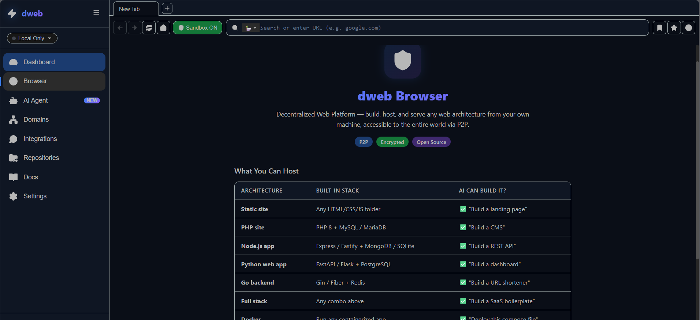
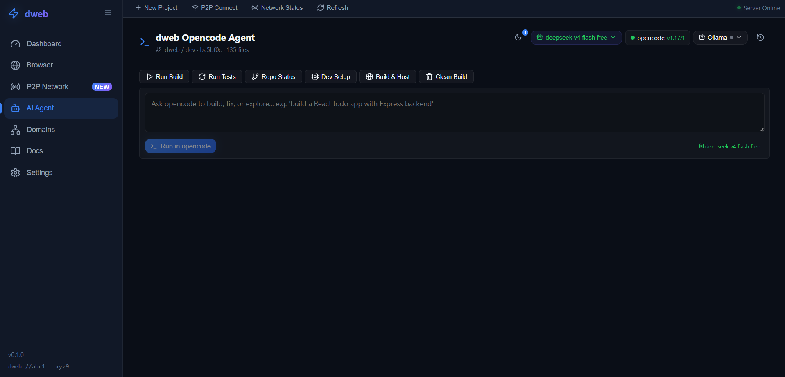
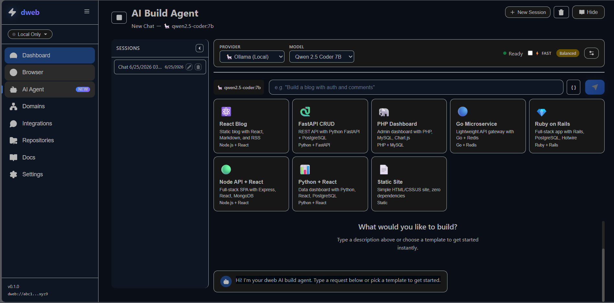
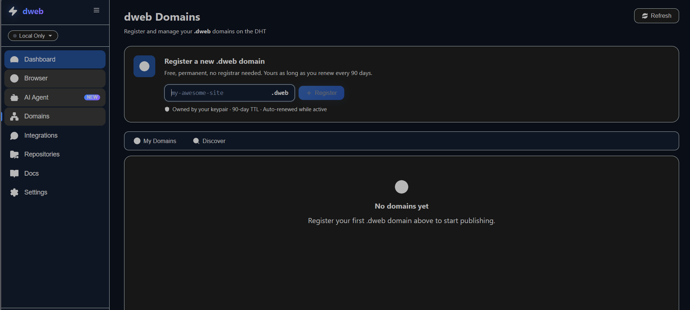
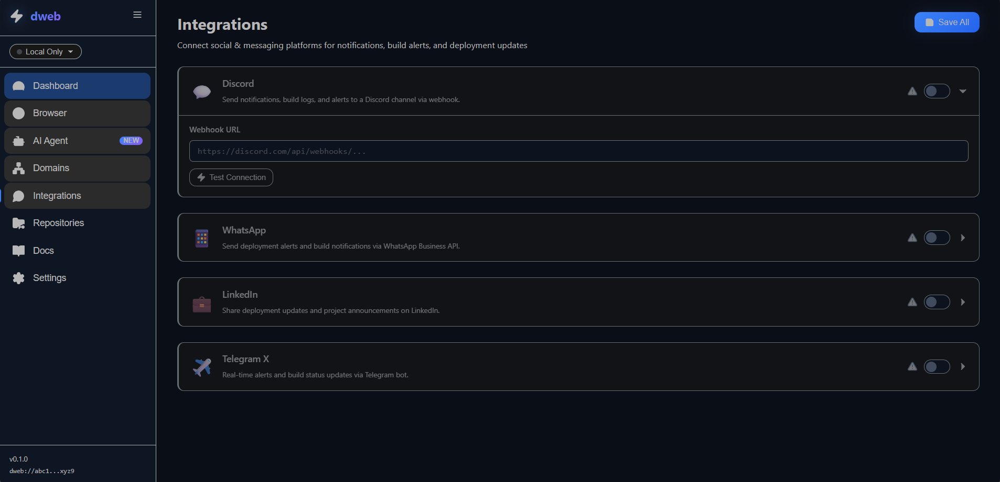
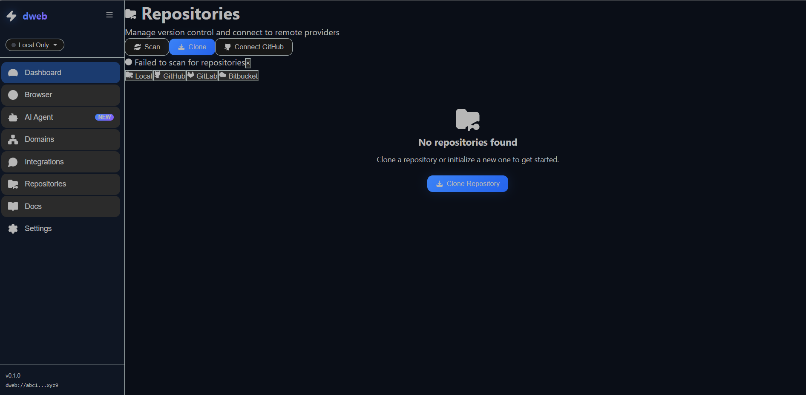

# dweb — Your Self-Hosted Dev Portal

Run services, register .dweb domains, code with AI — all on your own hardware.

[](LICENSE)
[]()
[]()
[]()
[]()

---

## Screenshots

| Dashboard | AI Agent | Domains |
|:---:|:---:|:---:|
|  |  |  |

| Browser | Repositories | Integrations |
|:---:|:---:|:---:|
|  |  |  |

---

## Features

- 🖥️ **Dev Portal** — Browser-based desktop to manage services, runtimes, and deployments
- 🌐 **.dweb Domains** — Register domains with Free / Premium / Business tiers
- 🤖 **Local AI** — Built-in Ollama + opencode CLI for AI-assisted development
- 📁 **File Browser** — Upload, manage, and share files through your browser
- ⚡ **WSL Native** — Runs inside Windows via WSL, accessible from any browser
- 🔌 **Extensible** — Add your own services via the API

---

## Quick Start

### Windows (WSL)

```bash
wsl --install -d dweb
```

> Coming soon to the Microsoft Store.

### Linux

```bash
# Docker image (recommended)
docker run -d -p 49737:49737 dweb/dweb

# Or direct install
curl -fsSL https://dweb.dev/install.sh | bash
```

### Build from Source

```bash
git clone https://github.com/dweb/dweb.git
cd dweb
npm install
npm run build
node tools/dweb-server.cjs
```

Open **http://localhost:49737** in your browser.

---

## Architecture

```
┌───────────────────────────────────────────────────────────┐
│                    Browser (port 49737)                    │
└─────────────────────────┬─────────────────────────────────┘
                          │
┌─────────────────────────▼─────────────────────────────────┐
│                   dweb Application                          │
│                                                             │
│  ┌──────────────────────────┐  ┌─────────────────────────┐ │
│  │   React Frontend         │  │   Node.js Server        │ │
│  │   (Vite + TypeScript)    │  │   (dweb-server.cjs)     │ │
│  │                          │  │                         │ │
│  │  Dashboard  BrowserView  │  │  Static serving         │ │
│  │  AI Agent   Domains      │  │  AI API proxy           │ │
│  │  Repos      Integrations │  │  WebRTC signaling       │ │
│  │  Settings   Docs         │  │  Rate limiting          │ │
│  └──────────────────────────┘  └──────────┬──────────────┘ │
│                                            │                │
│  ┌─────────────────────────────────────────▼──────────────┐ │
│  │              Tauri Desktop Shell (optional)             │ │
│  │  Rust backend: P2P (HyperDHT), domains (sled),        │ │
│  │  cloud deployment (AWS SigV4, Netlify, Vercel),       │ │
│  │  git integration, sandboxed process execution          │ │
│  └────────────────────────────────────────────────────────┘ │
│                                                             │
│  ┌────────────────────────────────────────────────────────┐ │
│  │              P2P Relay Daemon (port 49736)              │ │
│  │  dweb-relay.cjs — bootstrap, discovery, signaling      │ │
│  │  WebSocket push + HTTP polling fallback + TCP relay    │ │
│  └────────────────────────────────────────────────────────┘ │
└─────────────────────────────────────────────────────────────┘

          ┌─────────────────────────────────────┐
          │         Optional Services            │
          │  Ollama (local AI)  │  opencode CLI  │
          │  PostgreSQL         │  Redis         │
          └─────────────────────────────────────┘
```

---

## Tech Stack

| Layer | Technology |
|-------|-----------|
| Frontend | React 19, TypeScript 5.5, Vite 6, React Router 7, Lucide React |
| Backend | Node.js (zero-dependency HTTP server), Express-like routing |
| Desktop | Tauri v2 (Rust) — optional desktop shell |
| P2P | HyperDHT, WebRTC, WebSocket relay, HTTP fallback |
| AI | Ollama (local), OpenAI, Anthropic, Google Gemini, Groq, OpenRouter |
| Database | sled (embedded), localStorage fallback |
| Base OS | Alpine Linux (WSL distro) |

---

## Marketplace / Store

| Platform | Link |
|----------|------|
| Microsoft Store | [dweb for WSL](https://apps.microsoft.com) (coming soon) |
| Website | [https://dweb.dev](https://dweb.dev) |
| GitHub | [https://github.com/dweb/dweb](https://github.com/dweb/dweb) |

---

## .dweb Domain Tiers

| Tier | Price | Features |
|------|-------|----------|
| Free | $0 | 1 .dweb domain, basic P2P hosting |
| Premium | $3/mo | 5 domains, relay cache (always online) |
| Business | $10/mo | Unlimited domains, cloud shift, priority support |

---

## Contributing

Contributions are welcome! Please read [CONTRIBUTING.md](CONTRIBUTING.md) for guidelines.

1. Fork the repository
2. Create a feature branch (`git checkout -b feature/amazing-feature`)
3. Commit your changes (`git commit -m 'feat: add amazing feature'`)
4. Push to the branch (`git push origin feature/amazing-feature`)
5. Open a Pull Request

See the [Business Plan](BUSINESS-PLAN.md) and [Changelog](CHANGELOG.md) for project direction and history.

---

## Development

```bash
# Frontend only (HMR)
npm run dev

# Full type check
npm run lint
npm run typecheck

# Production build
npm run build
```

---

## License

MIT — see [LICENSE](LICENSE) for details.
